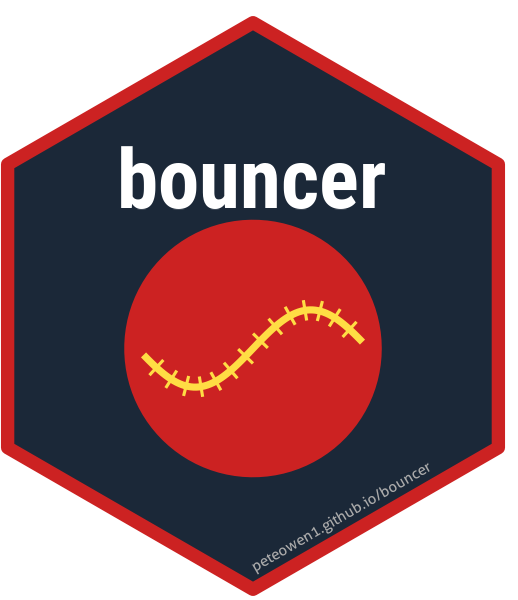

# bouncer 

<!-- badges: start -->
[](https://lifecycle.r-lib.org/articles/stages.html#experimental)
[](https://peteowen1.github.io/bouncer/)
<!-- badges: end -->

Cricket analytics R package with a **5-component prediction pipeline** featuring ball-by-ball skill tracking, match simulation, and pre-match predictions.

## Overview

`bouncer` tracks player, team, and venue skill at the **ball-by-ball level** using residual-based indices built on top of XGBoost context models. It combines a 3-Way ELO system (batter + bowler + venue) with PageRank network quality adjustments to power match simulations and predictions across T20, ODI, and Test formats.

```
 AGNOSTIC MODEL ──> SKILL INDICES ──> FULL MODEL ──> SIMULATIONS
       │                  │                │               │
       └── baseline ──────┴── residuals ───┘     PRE-GAME PREDICTIONS
```

## Installation

```r
# Install from GitHub
remotes::install_github("peteowen1/bouncer")
```

## Quick Start

```r
library(bouncer)

# Step 1: Install pre-processed cricket data (one-time setup, ~500 MB)
install_all_bouncer_data()

# Step 2: Look up a player
get_player("V Kohli", format = "t20")

# Step 3: Detailed player analysis (batting, bowling, skill history)
analyze_player("JJ Bumrah", format = "t20")

# Step 4: Pre-match win probability
predict_match(
  team1 = "India",
  team2 = "Australia",
  venue = "MCG",
  match_type = "T20"
)

# Step 5: Ball-by-ball match simulation
quick_match_simulation(format = "t20")

# Step 6: Visualize win probability over a completed match
plot_win_probability(match_id = "1415755")
```

## Core Functions

### Player Analysis

- `get_player()` - Player lookup with current skill indices and ELO ratings
- `analyze_player()` - Comprehensive player breakdown (batting, bowling, skill history)
- `compare_players()` - Side-by-side player comparison
- `search_players()` - Find players by partial name match
- `rank_players()` - Player rankings by skill index
- `player_batting_stats()` / `player_bowling_stats()` - Aggregated career statistics
- `analyze_batter_vs_bowler()` - Head-to-head matchup analysis

### Team Analysis

- `get_team()` - Team lookup with ELO ratings and skill indices
- `compare_teams()` - Head-to-head team comparison with win probability
- `head_to_head()` - Historical team vs team record
- `team_batting_stats()` / `team_bowling_stats()` - Team performance aggregates

### Predictions & Simulation

- `predict_match()` - Pre-match win probability
- `predict_match_outcome()` - Detailed match result prediction with confidence
- `predict_win_probability()` - In-match win probability
- `calculate_projected_score()` - Project innings total from current game state
- `simulate_match_ballbyball()` - Full ball-by-ball match simulation
- `quick_match_simulation()` - Fast match simulation with defaults
- `simulate_season()` / `simulate_season_n()` - Tournament simulation (Monte Carlo)
- `simulate_ipl_playoffs()` - IPL playoff bracket simulation

### Visualization

- `plot_win_probability()` - Win probability chart over a match
- `plot_score_progression()` - Innings scoring worm
- `plot_skill_progression()` - Player skill evolution over time
- `plot_player_comparison()` - Visual player comparison
- `plot_elo_history()` - ELO rating history
- `plot_team_strength()` - Team strength visualization
- `theme_bouncer()` - Custom ggplot2 theme

### Venue & Match Analysis

- `venue_stats()` - Venue scoring rates and conditions
- `analyze_match()` - Comprehensive match breakdown
- `query_matches()` - Search and filter matches

### Data Management

- `install_all_bouncer_data()` - Install complete dataset from GitHub releases
- `install_bouncer_data()` - Install specific formats/leagues from Cricsheet
- `update_bouncerdata()` - Incremental data updates
- `connect_to_bouncer()` / `disconnect_bouncer()` - Database connection management
- `load_matches()`, `load_deliveries()`, `load_players()` - Load data into R

See the [full function reference](https://peteowen1.github.io/bouncer/reference/) for all 120+ exported functions.

## How It Works

### The 5-Component Pipeline

1. **Agnostic Model** - An XGBoost model predicts delivery outcomes (runs/wickets) using only context features (over, wickets fallen, match phase) with no player/team/venue identity. This establishes a baseline expectation.

2. **Skill Indices** - Residual-based indices track how players, teams, and venues deviate from the agnostic baseline. Updated ball-by-ball using exponential moving averages:
   ```
   residual = actual_outcome - agnostic_expected
   new_skill = (1 - alpha) * old_skill + alpha * residual
   ```

3. **Full Model** - A second XGBoost model uses all agnostic features PLUS skill indices to make maximum-accuracy delivery predictions.

4. **Simulations** - Ball-by-ball match simulation using the full model, drawing from the predicted outcome distribution (wicket, 0, 1, 2, 3, 4, 6).

5. **Pre-Game Predictions** - Combines team ELO, aggregated player skills, venue characteristics, form, and head-to-head records to predict match outcomes before the first ball.

### 3-Way ELO System

The core rating system maintains separate ELO ratings for three entities on every delivery:

| Entity | Weight | What it captures |
|--------|--------|-----------------|
| **Batter** | 52% | Individual batting ability |
| **Bowler** | 22% | Individual bowling ability |
| **Venue (session)** | 21% | Short-term pitch conditions (prep, dew, deterioration) |
| **Venue (permanent)** | 5% | Long-term ground characteristics (size, typical pitch) |

### PageRank Quality Adjustment

A network centrality system detects when players accumulate high ratings by playing in isolated, low-quality competitions. Players who face strong opponents in well-connected tournaments receive quality-adjusted ratings.

## Data Source

All data comes from [Cricsheet](https://cricsheet.org), stored in a local DuckDB database. The package handles downloading, parsing, and database management automatically.

## Vignettes

- [Getting Started](https://peteowen1.github.io/bouncer/articles/getting-started.html) - Installation and first steps
- [Player Analysis](https://peteowen1.github.io/bouncer/articles/player-analysis.html) - Deep player analytics
- [Match Analysis](https://peteowen1.github.io/bouncer/articles/match-analysis.html) - Match breakdowns
- [Predictions](https://peteowen1.github.io/bouncer/articles/predictions.html) - Using the prediction system
- [Simulation](https://peteowen1.github.io/bouncer/articles/simulation.html) - Match and season simulation
- [Database Schema](https://peteowen1.github.io/bouncer/articles/database-schema.html) - Database table reference

## License

MIT

## Acknowledgments

- Data: [Cricsheet](https://cricsheet.org)
- Built with: DuckDB, XGBoost, dplyr, ggplot2

## Citation

If you use bouncer in research or publications, please cite:

```
@software{bouncer2026,
  title = {bouncer: Cricket Analytics with Ball-by-Ball Skill Tracking},
  author = {Pete Owen},
  year = {2026},
  url = {https://github.com/peteowen1/bouncer}
}
```
